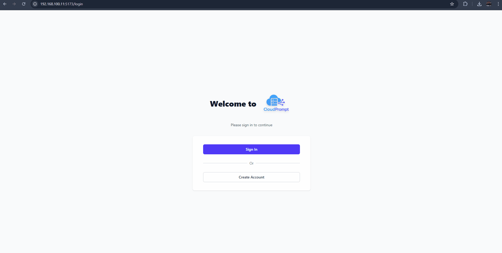

<h1 align="center">
 <a href="#">
  <picture>
    <source media="(prefers-color-scheme: dark)" srcset="photos/logo.png"/>
    
  </picture>
 </a>
 <br />
</h1>
<p align="center">
    ☁️ Automate cloud infrastructure tasks using simple LLM prompts ☁️
</p>



## Setup .env file
```.env
#AWS Credentials
AWS_ACCESS_KEY_ID=
AWS_SECRET_ACCESS_KEY=

#Proxmox Credentials
PROXMOX_HOST=
PROXMOX_USER=
PROXMOX_PASS=

#OPENAI Configs
MODEL=gpt-4o-mini
OPENAI_API_KEY=

#Logfire token
LOGFIRE_TOKEN=

#LangSmith OpenTelemetry variables
LANGSMITH_TRACING="true"
LANGSMITH_ENDPOINT="https://api.smith.langchain.com"
LANGSMITH_API_KEY=""
LANGSMITH_PROJECT=""
```

## Setup
1. Clone the repository:
    ```bash
    git clone https://github.com/cristibtz/CloudPrompt.git
    cd CloudPrompt
    ```
2. Setup virtual environment and install the required packages:
    ```bash
    python -m venv venv
    source venv/bin/activate  # On Windows use 'venv\Scripts\activate'
    pip install -r requirements.txt # Or 'pip install -e .'
    ```
3. Set up the `.env` file with your credentials and configurations as shown above.

4. Start MCP server:
    ```bash
    python mcp_server/mcp_server.py
    ```
5. Start backend API:
    ```bash
    fastapi run backend/api.py --port 8888
    ```
6. Start frontend:
    ```bash
    cd cloudprompt-frontend
    npm install
    npm run dev
    ```
7. Open your browser and navigate to `http://localhost:3000` to access the CloudPrompt frontend. Or use CLI tool:
    ```bash
    python3 cloudprompt/cli/cli_tool.py # Or 'cloudprompt -p 'PROMPT' -c 'CLOUD PROVIDER'
    ```