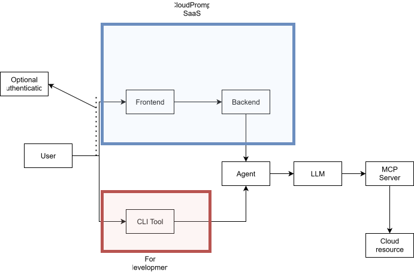

## To do

- [ ] Improve application architecture
    - [ ] Add Database for user management
    - [ ] Add In-Memory Database for prompt history
    - [ ] Create Agentic architecture diagram
    - [ ] Create Saas app diagram 

- [ ] Bring improvements
    - [ ] Agent
        - [ ] Evaluate best way to handle cloud prompt routing
    - [ ] MCP Server
        - [ ] Researching how to add another cloud
    - [ ] Frontend
        - [ ] Think about UX, layout of first page
    - [ ] CLI
        - [ ] Maybe add more arguments(like credentials)
    - [ ] Add credentials checks and think how to handle credentials for individual users and for the 5 cloud platforms starting with Amazon

- [ ] Start creating detailed Word documentation until present progress and continuosly improve

## After adding DB
- [ ] Find ORM
- [ ] Define DB initial architecture diagram
- [ ] Do continuous testing

