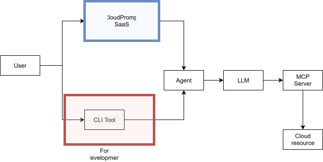

## To do

- [x] Experiment with Proxmox and prepare to add app functionality
    - [x] Create test env
    - [x] Add basic functionality 

- [x] Improve application architecture
    - [x] Add Database for user management
    - [x] Create Saas app diagram 

- [x] Bring improvements
    - [x] Agent
        - [x] Evaluate best way to handle cloud prompt routing
    - [x] MCP Server
        - [x] Researching how to add another cloud
    - [x] Frontend
        - [x] Think about UX, layout of first page
        - [x] Add a way to select cloud provider
    - [x] CLI
        - [x] Maybe add more arguments(like credentials)
        - [x] Add provider parameter to specify which cloud provider to use
    - [x] Backend
        - [x] Find ORM
        - [x] Define DB initial architecture diagram
        - [x] Define API endpoints
    - [x] Add credentials checks and think how to handle credentials for individual users and for the 5 cloud platforms starting with Amazon - Pass credentials to agent via prompt and it will inject them into MCP server tools

- [x] Start creating detailed Word documentation until present progress and continuosly improve

### v0.0.2 App arch

