# Start Keycloak server
```bash
docker run -d --name keycloak-cloudprompt -p 8080:8080 -e KC_BOOTSTRAP_ADMIN_USERNAME=cloudprompt -e KC_BOOTSTRAP_ADMIN_PASSWORD=cloudprompt quay.io/keycloak/keycloak:26.1.0 start-dev
```

# Create new admin account and set password
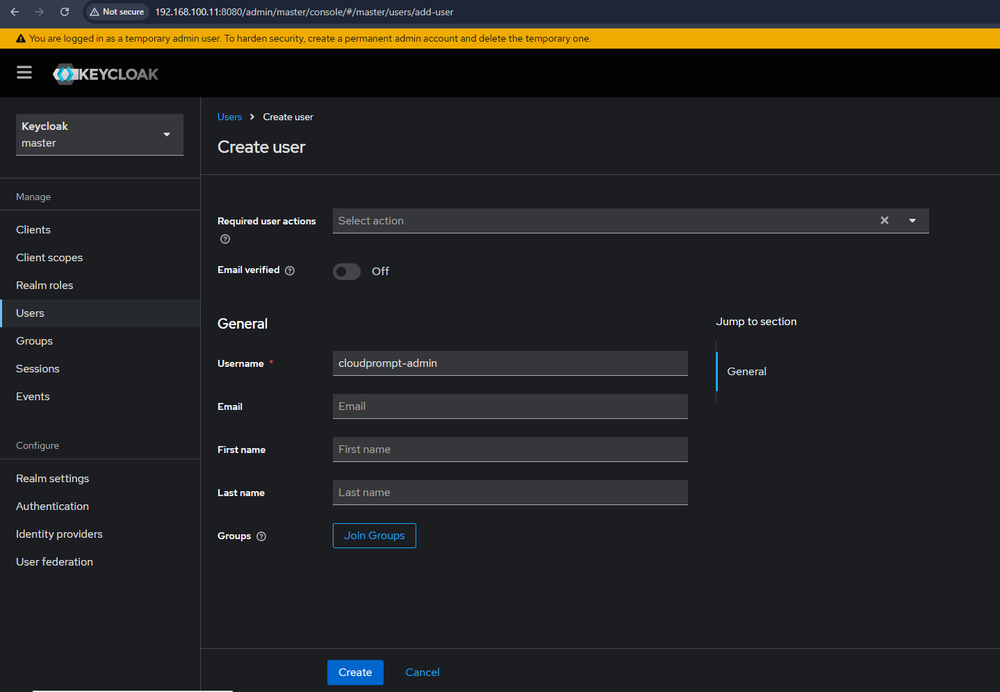

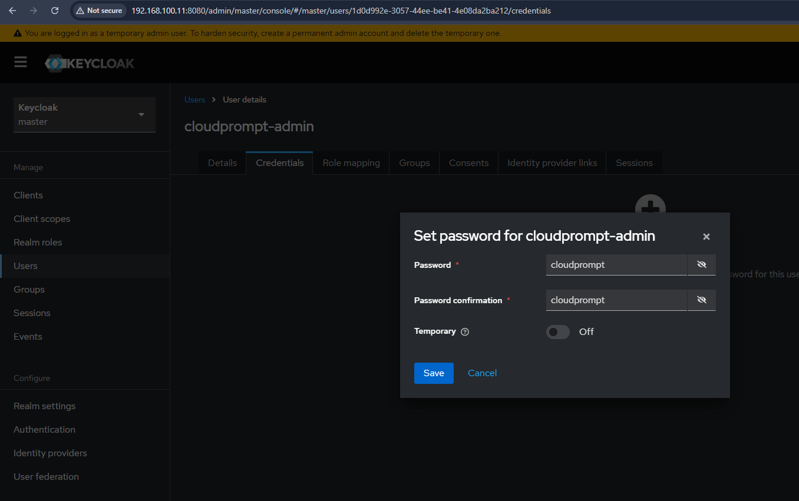

>Assign admin realm role
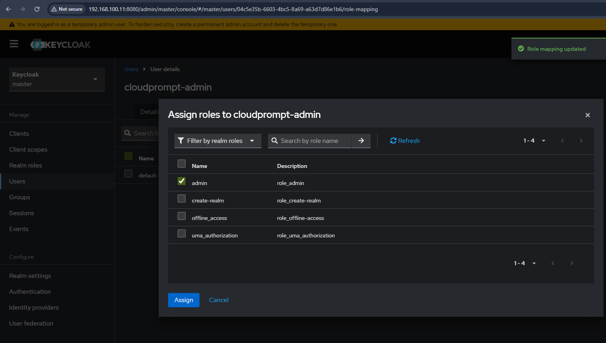

>Delete old user admin user

# Create new realm
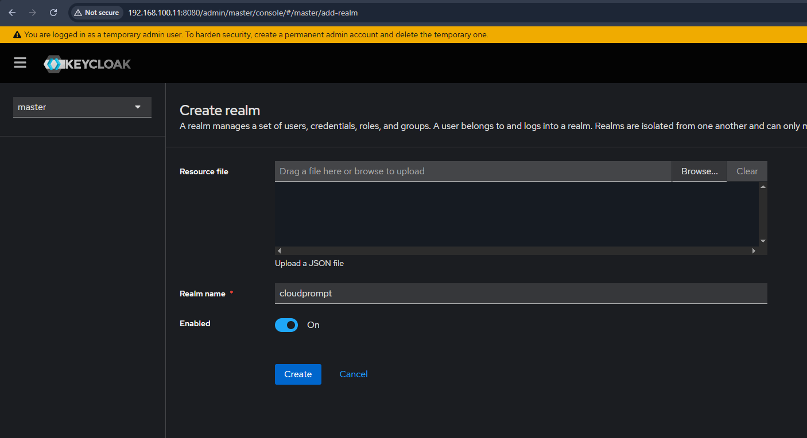

# Create first user in the new realm
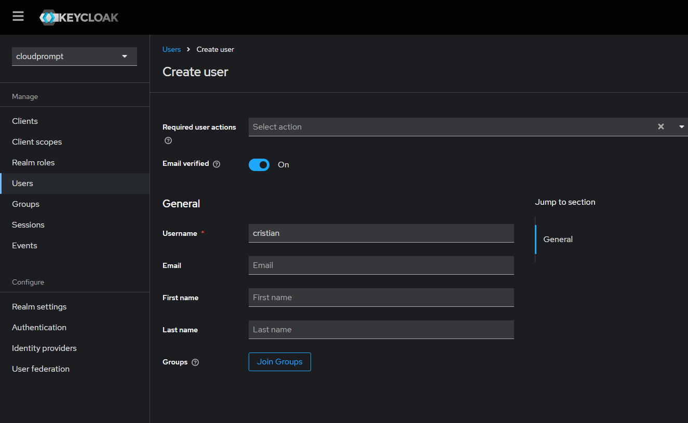

# Create new client
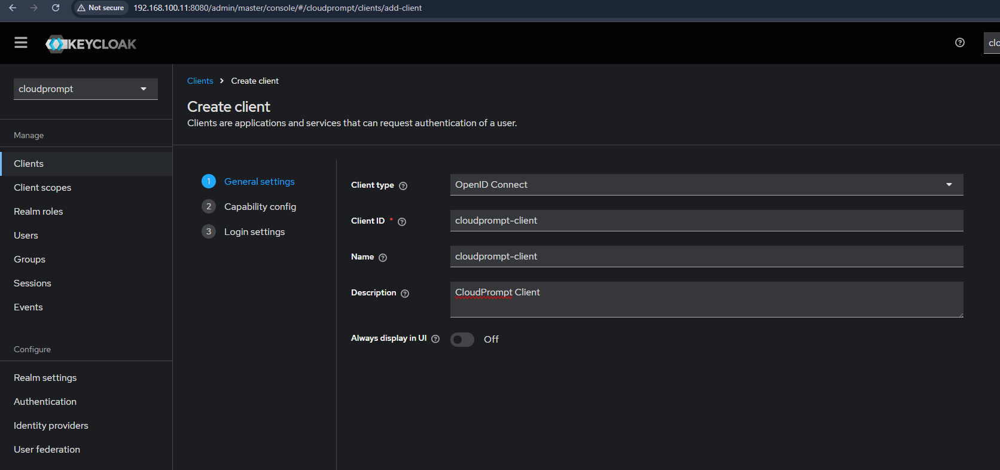
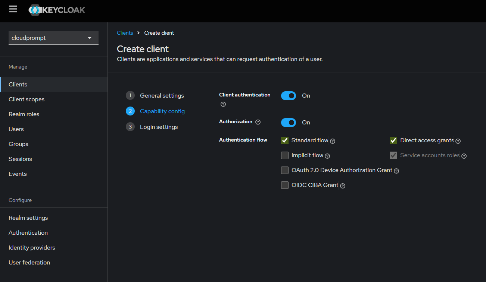
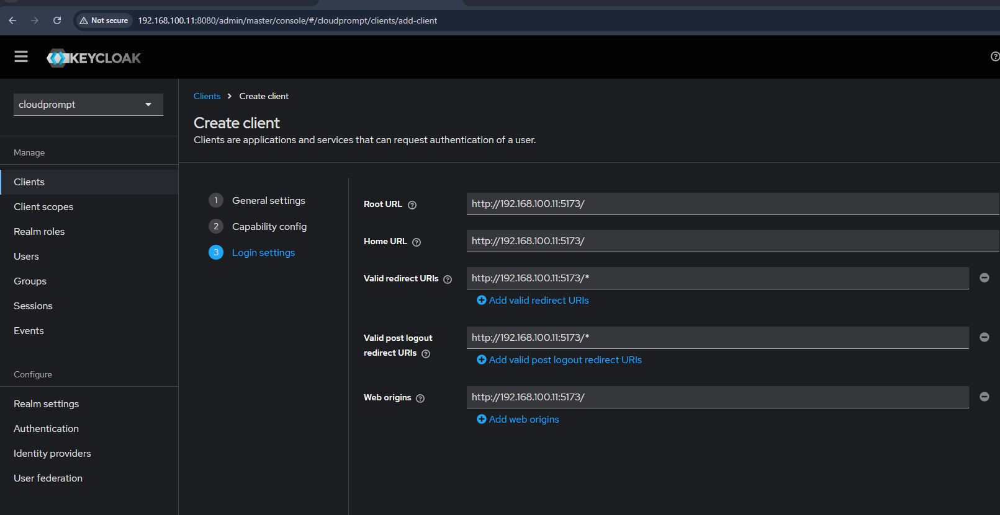

# Create client scope
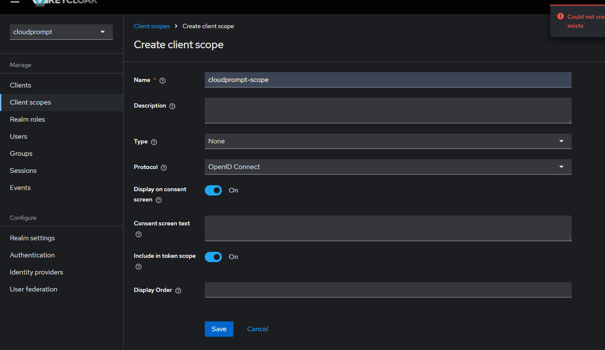

# Add audience mapper to client scope
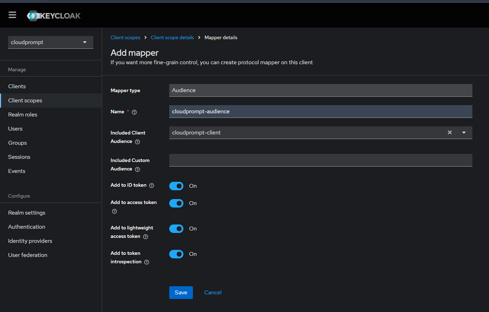

# Assign client scope to client
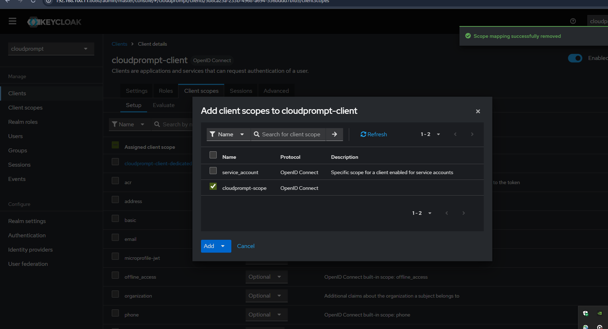

---

# Install custom Keycloak
```bash
docker run -d --name keycloak-cloudprompt -p 8080:8080 \
    --add-host=host.docker.internal:host-gateway \
    -e KEYCLOAK_ADMIN=admin -e KEYCLOAK_ADMIN_PASSWORD=admin \
    quay.io/phasetwo/phasetwo-keycloak:latest \
    start-dev --spi-events-listener-ext-event-webhook-store-webhook-events=true
```

# Configure webhook
```bash
# Get admin token
TOKEN=$(curl -X POST "http://192.168.100.11:8080/realms/master/protocol/openid-connect/token" \
  -H "Content-Type: application/x-www-form-urlencoded" \
  -d "grant_type=password&client_id=admin-cli&username=cloudprompt-admin&password=cloudprompt" | jq -r '.access_token')

# Create webhook for user events
curl -X POST "http://192.168.100.11:8080/realms/cloudprompt/webhooks" \
  -H "Authorization: Bearer $TOKEN" \
  -H "Content-Type: application/json" \
  -d '{
    "enabled": true,
    "url": "http://192.168.100.11:8888/api/v1/users/keycloak-webhook",
    "secret": "cloudprompt-secret",
    "eventTypes": ["access.LOGIN","access.LOGOUT","access.REGISTER","access.CODE_TO_TOKEN"]
  }'
```
# Verify Webhook Configuration
```bash
# List webhooks
curl -X GET "http://192.168.100.11:8080/realms/cloudprompt/webhooks" \
  -H "Authorization: Bearer $TOKEN"
```

# Delete webhook
```bash
curl -X DELETE "http://192.168.100.11:8080/realms/cloudprompt/webhooks/c3438685-bc3c-4c45-bb54-d4a4bf246b20" \
  -H "Authorization: Bearer $TOKEN"
```